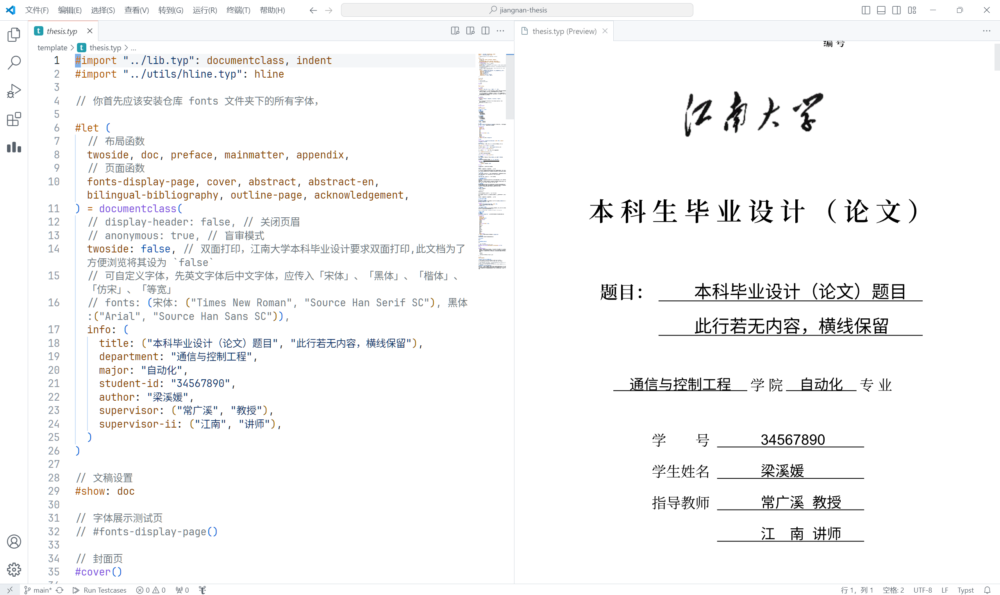

# 江南大学学位论文 jiangnan-thesis

江南大学毕业论文（设计）的 Typst 模板，由 [modern-nju-thesis](https://github.com/nju-lug/modern-nju-thesis) 二次开发而来

## 特性

- 该模板存在**不被认可的风险**
- 目前仅支持本科生毕业论文（设计）
- 也许你可以在 [modern-nju-thesis](https://github.com/nju-lug/modern-nju-thesis) 找到一些使用 Typst 的提示
- 更多关于 Typst 的内容: [Typst](https://typst.app/)

## 致谢

- 感谢 [@OrangeX4](https://github.com/OrangeX4) 与 [@Yanglin Xun](https://github.com/FurryAcetylCoA) 开发的 [modern-nju-thesis](https://github.com/nju-lug/modern-nju-thesis) Typst 模板

## License

This project is licensed under the MIT License.
